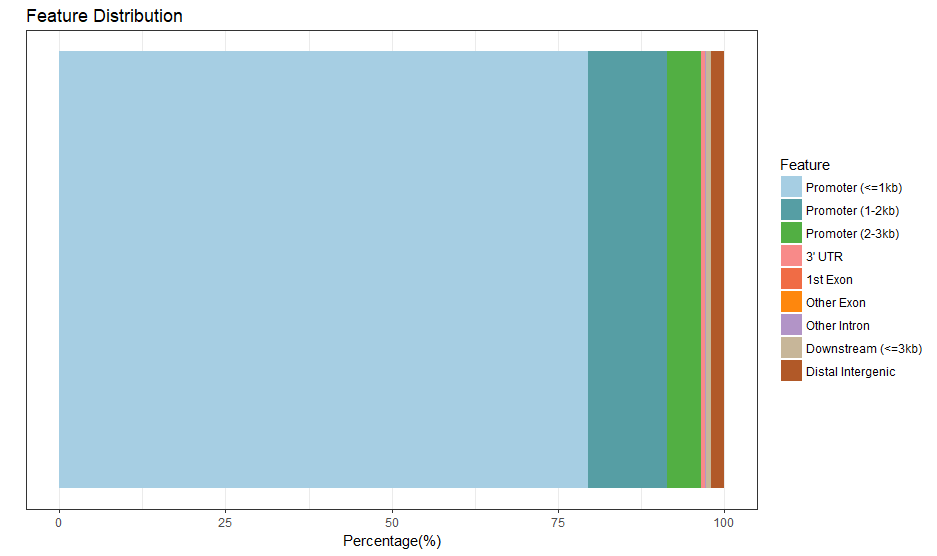

ChIPseeker的功能分为三类: 
> ● 注释：提取peak附近最近的基因， 注释peak所在区域 
> ● 比较：估计ChIP peak数据集中重叠部分的显著性；整合GEO数据集，以便于将当前结果和已知结果比较 
> ● 可视化： peak的覆盖情况；TSS区域结合的peak的平均表达谱和热图；基因组注释；TSS距离；peak和基因的重叠。

 peak落在了什么地方，启动子？外显子？内含子？还是基因间区？下面用ChIPseeker中的几个函数来绘制分析图。
 
 

          
         
		 
		 

